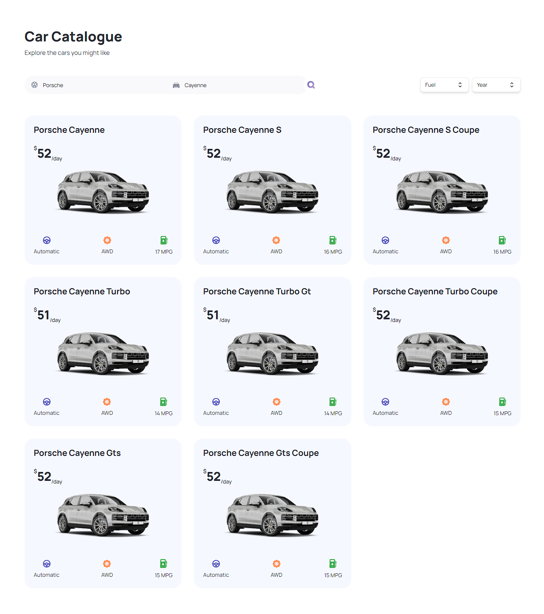

## Autoland is an automobile showcase app



## 🛠️ Stack

- [**Next.js**](https://nextjs.org/) - The web framework for high-quality web applications.
- [**Typescript**](https://www.typescriptlang.org/) - JavaScript with syntax for types.
- [**Tailwindcss**](https://tailwindcss.com/) - A utility-first CSS framework for rapidly building custom designs.

## Key Features:

**Home Page**: Showcases a visually appealing display of cars fetched from a third-party API, providing a captivating introduction to the diverse range of vehicles available.

**Exploration and Filtering**: Explore a wide variety of cars from around the world, utilizing a search and filter system based on criteria such as model, manufacturer, year, fuel type, and make.

**Transition to Server-Side Rendering**: A seamless transition from client-side rendering to server-side rendering, enhancing performance and providing a smoother browsing experience.

**Pagination**: For easy navigation through a large dataset of cars, allowing users to explore multiple pages effortlessly.

**Metadata Optimization and SEO**: Optimize metadata for car listing, enhancing search engine optimization (SEO) and ensuring better visibility on search engine results pages.

**Responsive Website Design**: The website is designed to be visually pleasing and responsive, ensuring an optimal user experience across various devices.

## Prerequisites

**Node version 18.x.x**

### Cloning the repository

```shell
git clone https://github.com/patchitodev/autoland.git
```

### Install packages

```shell
npm i
```

### Setup .env file

```js
NEXT_PUBLIC_RAPID_API_KEY=
NEXT_PUBLIC_IMAGIN_API_KEY=
```

Replace the placeholder values with your actual credentials. You can obtain these credentials by signing up on the corresponding websites from Rapid API to [Imagin Cars](https://www.imagin.studio/solutions/api)

### Start the app

```shell
npm run dev
```
